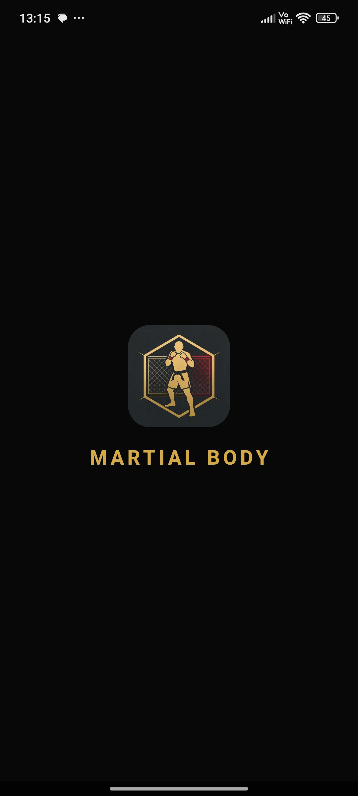
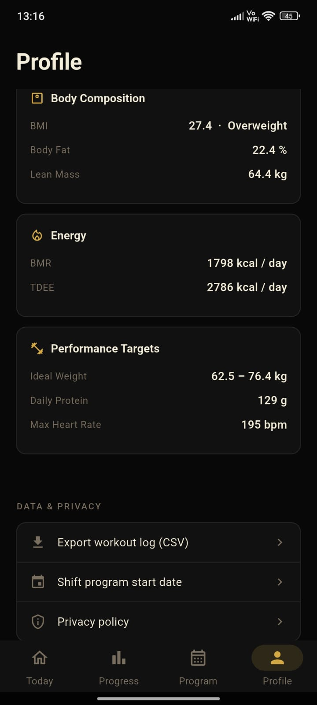
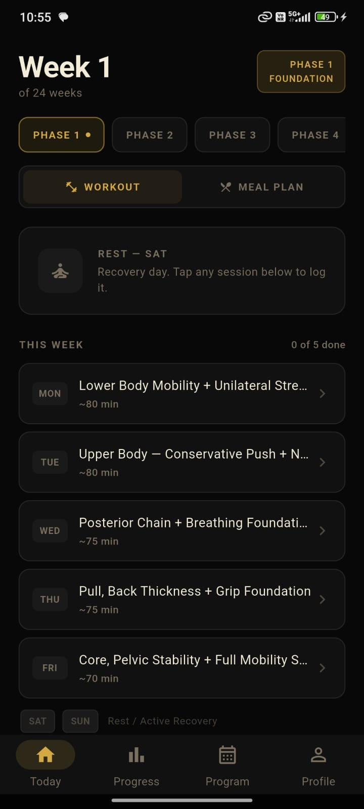
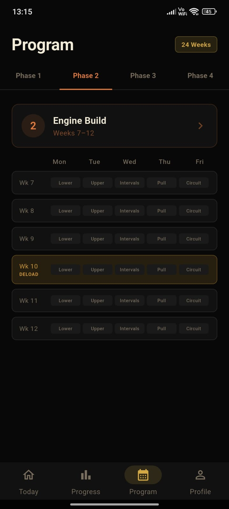
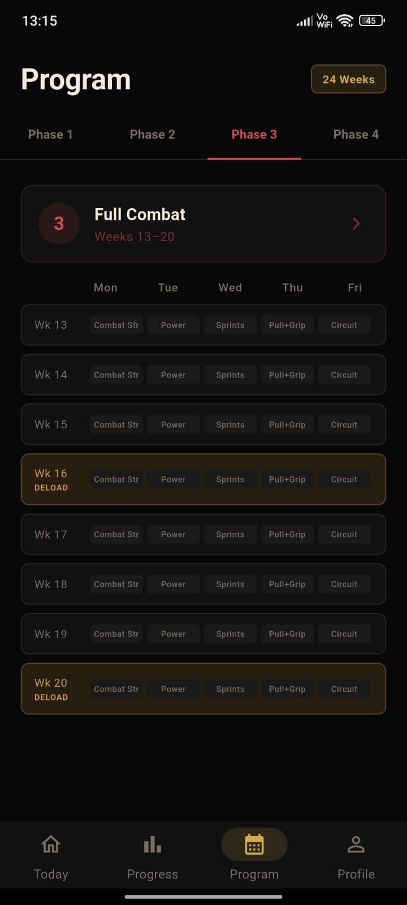
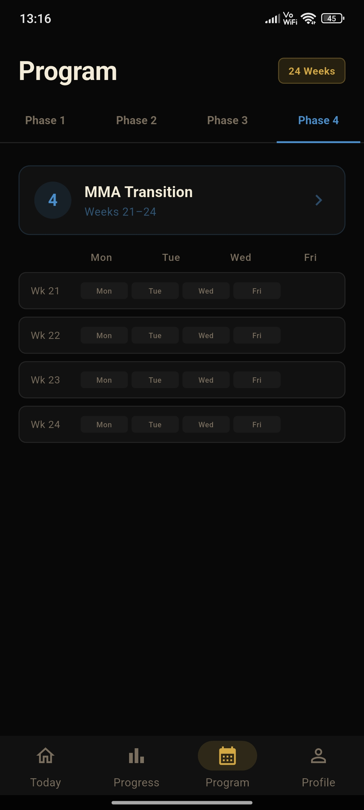

<p align="center">
  
</p>

<h1 align="center">Martial Body</h1>

<p align="center">
  <strong>A 24-week MMA preparation programme — fully offline, no accounts, no cloud.</strong>
</p>

<p align="center">
  <a href="LICENSE"></a>
  
  
  
</p>

<p align="center">
  <a href="https://f-droid.org/packages/com.robinroy.martial_body/">
    
  </a>
  &nbsp;&nbsp;
  <a href="https://github.com/BloodBlinker/martial-body/releases">
    
  </a>
</p>

---

Martial Body is a free and open-source Android app that guides a complete beginner through a structured 24-week training programme designed to get them physically ready to walk into their first MMA class. It is **not** a generic fitness app — there is one fixed programme, one path, and one goal.

The entire programme lives on-device in a local SQLite database. No internet connection is required after installation. **No telemetry, no analytics, no ads.**

---

## Table of Contents

- [Why Martial Body?](#why-martial-body)
- [Features](#features)
- [Screenshots](#screenshots)
- [Install (APK)](#install-apk)
- [Build from source](#build-from-source)
- [Project structure](#project-structure)
- [Tech stack](#tech-stack)
- [Contributing](#contributing)
- [Acknowledgements](#acknowledgements)
- [License](#license)

---

## Why Martial Body?

Most fitness apps dump you into a generic exercise library and tell you to figure it out. If you're a complete beginner who wants to prepare for MMA, that's useless — you don't know what you don't know.

Martial Body takes a different approach:

- **One programme, one goal** — every session is mapped out for you, from Foundation to MMA Transition.
- **24 weeks, 4 phases** — progressive overload with automatic deload weeks baked in.
- **Your data stays yours** — zero network calls, zero permissions, zero tracking.
- **Built for day one** — you don't need to be fit to start; the programme meets you where you are.

This app exists because the developer needed it and it didn't exist. It is opinionated by design.

---

## Features

- **4-phase progressive programme** — Foundation → Engine Build → Full Combat → MMA Transition
- **Guided active sessions** — step-by-step walkthrough of every exercise, set, rep, and rest period
- **Automatic deload weeks** — volume reduced 40-50 % on weeks 4, 10, 16, and 20
- **Interval timer** — built-in work/rest timer for conditioning blocks and sprint intervals
- **Phase 4 taper & shadowboxing** — progressive volume reduction with shadowboxing integration
- **Left-shoulder safety protocol** — contextual warnings during pressing movements
- **Progress tracking** — session history, weekly completion, phase progress, and streak tracking
- **Progress charts** — visual analytics powered by fl_chart
- **Profile & health metrics** — BMI, BMR, Devine ideal weight, Deurenberg body fat estimates
- **CSV export** — export your workout history via the share sheet
- **Phase-specific meal plans** — reference nutrition guidelines for each training phase
- **Fully offline** — zero network calls, zero permissions beyond storage
- **Dark theme** — single cohesive dark UI throughout
- **No accounts, no cloud sync, no ads, no tracking**

---

## Screenshots

<p align="center">
  
  &nbsp;
  
  &nbsp;
  
</p>
<p align="center">
  <em>Profile & health metrics • Guided session walkthrough • Programme overview</em>
</p>

<br />

<p align="center">
  
  &nbsp;
  
  &nbsp;
  
</p>
<p align="center">
  <em>Full Combat phase • MMA Transition phase • Progress analytics</em>
</p>

---

## Install (APK)

1. Download the latest APK from the [Releases](https://github.com/BloodBlinker/martial-body/releases) page.
2. On your Android device, go to **Settings → Security** (or **Apps → Special access**) and enable **Install from unknown sources** for your file manager or browser.
3. Open the downloaded `.apk` file and tap **Install**.
4. Launch **Martial Body** from your app drawer.

> **Minimum requirement:** Android 12 (API 31) or newer.

---

## Build from source

### Prerequisites

| Tool | Version |
|------|---------|
| Flutter SDK | ≥ 3.3.0 (stable channel) |
| Dart SDK | ≥ 3.3.0 (bundled with Flutter) |
| Android SDK | API 34+ with build-tools |
| Java JDK | 17 |
| Git | any recent version |

### Steps

```bash
# 1. Clone the repository
git clone https://github.com/BloodBlinker/martial-body.git
cd martial-body/martial_body

# 2. Install Flutter dependencies
flutter pub get

# 3. Generate drift database code
dart run build_runner build --delete-conflicting-outputs

# 4. Run on a connected device / emulator
flutter run

# 5. Or build a release APK
flutter build apk --release
# Output: build/app/outputs/flutter-apk/app-release.apk
```

> **Note:** Release builds use debug signing by default if `android/key.properties` is absent.
> To sign with your own keystore, create `android/key.properties`:
>
> ```properties
> storePassword=<your-store-password>
> keyPassword=<your-key-password>
> keyAlias=upload
> storeFile=<path-to-your-keystore.jks>
> ```

### Running tests

```bash
flutter test
```

Tests cover health-metric calculations, phase-boundary logic, and DAO round-trips.

---

## Project structure

```
martial-body/
├── LICENSE                        # GNU GPL-3.0
├── NOTICE                         # Author attribution & third-party notices
├── README.md                      # This file
├── docs/                          # Design documents (PRD, architecture)
├── fastlane/                      # F-Droid/Google Play metadata & screenshots
└── martial_body/                  # Flutter project root
    ├── android/                   # Android platform shell
    ├── assets/                    # App icons
    ├── lib/
    │   ├── main.dart              # Bootstrap: database, seeder, providers
    │   ├── app.dart               # MaterialApp.router + bottom-nav shell
    │   ├── core/
    │   │   ├── database/          # Drift schema, tables, DAOs
    │   │   ├── models/            # UI-facing view models
    │   │   ├── program/           # Phase math (week → phase mapping)
    │   │   ├── providers/         # Riverpod providers
    │   │   ├── seed/              # Phase 1-4 programme data + seeder
    │   │   ├── content/           # Phase descriptive content
    │   │   ├── export/            # CSV exporter
    │   │   ├── meal_plans/        # Per-phase meal plan data
    │   │   ├── theme/             # Dark colour palette + ThemeData
    │   │   └── utils/             # Formatting helpers
    │   └── features/
    │       ├── home/              # Today dashboard + meal plan view
    │       ├── session/           # Session overview + active logging
    │       ├── progress/          # Charts & analytics
    │       ├── program/           # 24-week calendar + phase detail
    │       ├── profile/           # Biometric form + health metrics
    │       ├── onboarding/        # First-launch intro flow
    │       └── splash/            # Splash / routing gate
    ├── test/                      # Unit & widget tests
    └── pubspec.yaml               # Dependencies
```

---

## Tech stack

| Layer | Library | License |
|-------|---------|---------|
| Framework | [Flutter](https://flutter.dev) / Dart | BSD-3-Clause |
| Database | [drift](https://pub.dev/packages/drift) 2.22 | MIT |
| State | [flutter_riverpod](https://pub.dev/packages/flutter_riverpod) 2.6 | MIT |
| Routing | [go_router](https://pub.dev/packages/go_router) 14.6 | BSD-3-Clause |
| Charts | [fl_chart](https://pub.dev/packages/fl_chart) 0.68 | MIT |
| Sharing | [share_plus](https://pub.dev/packages/share_plus) 10.1 | BSD-3-Clause |
| SQLite | [sqlite3_flutter_libs](https://pub.dev/packages/sqlite3_flutter_libs) | MIT |

---

## Contributing

Contributions are welcome! Please follow these steps:

1. **Fork** the repository.
2. **Create a feature branch:** `git checkout -b feature/my-change`
3. **Commit** your changes with a clear message.
4. **Push** to your fork: `git push origin feature/my-change`
5. **Open a Pull Request** against `main`.

### Guidelines

- Follow existing code style and project structure.
- Add the GPL-3.0 license header to every new `.dart` source file (see any existing file for the format).
- Do **not** add dependencies that require network access at runtime — the app must remain fully offline.
- Do **not** add proprietary or non-free dependencies — the project targets F-Droid compatibility.
- Write tests for new logic (especially anything touching `phase_math` or database operations).
- Keep commits atomic and well-described.

### Reporting issues

Open an issue on [GitHub Issues](https://github.com/BloodBlinker/martial-body/issues) with:
- Device model and Android version
- Steps to reproduce
- Expected vs. actual behaviour

---

## Acknowledgements

- The [Flutter](https://flutter.dev) team for the framework and tooling.
- [Simon Binder](https://github.com/simolus3) for [Drift](https://pub.dev/packages/drift) — the reactive SQLite layer that powers the entire app.
- [Remi Rousselet](https://github.com/rrousselGit) for [Riverpod](https://pub.dev/packages/flutter_riverpod) — clean, testable state management.
- [imaN Mahdi](https://github.com/imaNNeo) for [fl_chart](https://pub.dev/packages/fl_chart) — the charting library behind the progress analytics.
- The [F-Droid](https://f-droid.org) project for championing libre software distribution on Android.

---

## License

```
Martial Body — 24-week MMA preparation trainer
Copyright (C) 2026 Robin Roy

This program is free software: you can redistribute it and/or modify
it under the terms of the GNU General Public License as published by
the Free Software Foundation, either version 3 of the License, or
(at your option) any later version.

This program is distributed in the hope that it will be useful,
but WITHOUT ANY WARRANTY; without even the implied warranty of
MERCHANTABILITY or FITNESS FOR A PARTICULAR PURPOSE.  See the
GNU General Public License for more details.

You should have received a copy of the GNU General Public License
along with this program.  If not, see <https://www.gnu.org/licenses/>.
```
