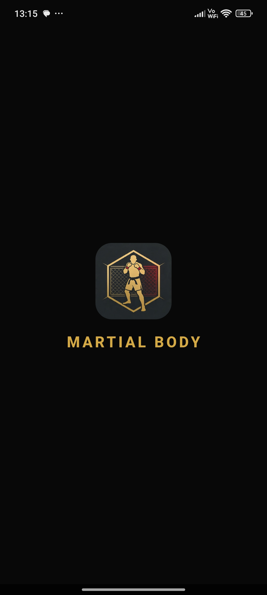
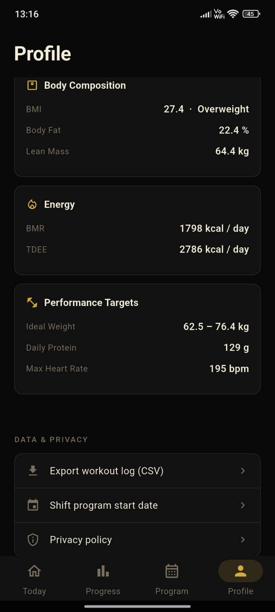
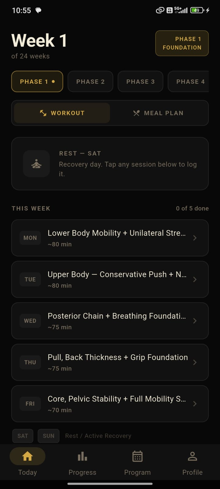
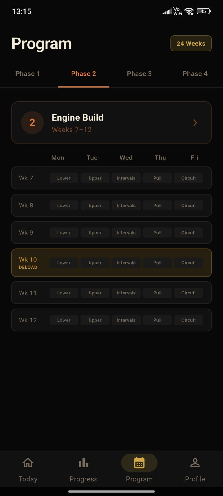
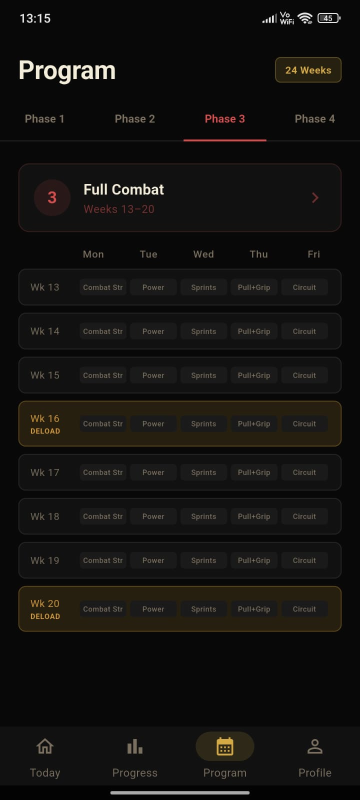
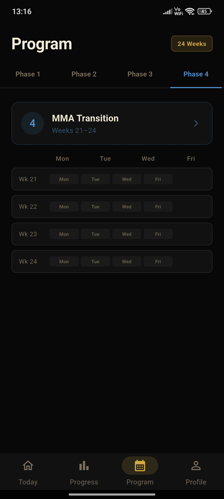

<p align="center">
  
</p>

<h1 align="center">Martial Body</h1>

<p align="center">
  <strong>A free, offline 24-week MMA training programme for complete beginners — no accounts, no ads, no cloud.</strong>
</p>

<p align="center">
  <a href="LICENSE"></a>
  
  
  
</p>

<p align="center">
  <a href="https://f-droid.org/packages/com.robinroy.martial_body/">
    
  </a>
  &nbsp;&nbsp;
  <a href="https://github.com/BloodBlinker/martial-body/releases">
    
  </a>
  &nbsp;&nbsp;
  
</p>

---

**Martial Body** is a free, open-source Android MMA training app that takes a complete beginner from zero fitness to walk-in-ready for their first MMA class — in 24 structured weeks. No gym membership needed to start. No guesswork. Just follow the programme.

Everything runs 100% on-device. No internet required, no telemetry, no ads, no tracking of any kind.

---

## Why Martial Body?

Most fitness apps throw you into an exercise library and leave you guessing. If you're a beginner who wants to prepare for MMA, that's useless — you don't know what you don't know.

Martial Body is different:

- **One programme, one goal** — every session is mapped out, from Foundation to MMA Transition
- **Progressive overload built-in** — automatic deload weeks, no manual planning needed
- **Your data stays on your phone** — zero network calls, no internet permission (only local notifications + keep-awake)
- **Built for day one** — you don't need to be fit to start; the programme meets you where you are

---

## Features

- **4-phase MMA preparation programme** — Foundation → Engine Build → Full Combat → MMA Transition (6 + 6 + 8 + 4 weeks)
- **Guided active sessions** — step-by-step walkthrough of every exercise, set, rep, tempo, and rest period
- **Built-in timers** — per-set rest timer plus count-up timers for conditioning and sprint-interval blocks
- **Completion-anchored progression** — the week advances only when you complete it; miss two weekday workouts in a week and it resets, so the programme can't quietly drift out from under you
- **Automatic deload weeks** — volume reduced 40–50% on weeks 4, 10, 16, and 20
- **Phase 4 taper & shadowboxing** — progressive volume reduction with shadowboxing integration
- **Journey map** — a visual 24-week path showing your phase, rank (I → IV), and momentum at a glance
- **Achievements & graduation** — milestone badges that unlock as you progress, with an end-of-programme completion screen
- **Personal records & progression charts** — automatic PR tracking and per-exercise weight-over-time graphs
- **Bodyweight tracking** — log your weight and watch the trend
- **Progress analytics** — session history, weekly volume/sessions charts with plain-language takeaways, and recovery (RPE/sleep) mapping
- **Smart reminders** — gentle re-engagement notifications, with sooner streak-recovery nudges when a week is at risk
- **Metric & Imperial units** — kg/cm or lb/in, switchable any time
- **Light & dark themes**
- **Health metrics** — BMI, BMR/TDEE, Devine ideal weight, Deurenberg body-fat estimates
- **Phase-specific meal plans** — nutrition guidelines matched to each training phase
- **CSV export** — export your full workout history via the share sheet
- **Fully offline** — no internet permission, no telemetry, no ads, no accounts; your data never leaves the device

---

## Screenshots

<p align="center">
  
  &nbsp;
  
  &nbsp;
  
</p>
<p align="center">
  <em>Health metrics &nbsp;•&nbsp; Guided session &nbsp;•&nbsp; Programme overview</em>
</p>

<br />

<p align="center">
  
  &nbsp;
  
  &nbsp;
  
</p>
<p align="center">
  <em>Full Combat phase &nbsp;•&nbsp; MMA Transition &nbsp;•&nbsp; Progress analytics</em>
</p>

---

## Install

**Option 1 — F-Droid** *(recommended)*
Install from [F-Droid](https://f-droid.org/packages/com.robinroy.martial_body/) — fully libre, no Google Play required.

**Option 2 — Direct APK**
1. Download the latest `.apk` from [Releases](https://github.com/BloodBlinker/martial-body/releases)
2. On your device: **Settings → Security → Install from unknown sources**
3. Open the file and tap **Install**

> Requires **Android 12** (API 31) or newer.

---

## Build from Source

```bash
git clone https://github.com/BloodBlinker/martial-body.git
cd martial-body/martial_body
flutter pub get
dart run build_runner build --delete-conflicting-outputs
flutter run                          # run on device/emulator
flutter build apk --release          # build release APK
```

**Prerequisites:** Flutter ≥ 3.3.0 · Dart ≥ 3.3.0 · Android SDK API 34+ · Java JDK 17

```bash
flutter test   # run unit & widget tests
```

---

## Tech Stack

| Layer | Library |
|-------|---------|
| Framework | Flutter / Dart |
| Database | drift 2.22 (SQLite) |
| State | flutter_riverpod 2.6 |
| Routing | go_router 14.6 |
| Charts | fl_chart 0.68 |

---

## Contributing

Bug reports and pull requests are welcome.

1. Fork → create a feature branch → commit → open a PR against `main`
2. Keep the app fully offline — no runtime network dependencies
3. No proprietary libraries — F-Droid compatibility is a hard requirement
4. Add the GPL-3.0 header to every new `.dart` file

Open issues at [GitHub Issues](https://github.com/BloodBlinker/martial-body/issues) with your device model, Android version, steps to reproduce, and expected vs. actual behaviour.

---

## Support the Project 🎓

Martial Body is free and always will be. I'm  a developer from Kerala, India. I built this app because I needed it and it didn't exist. Every contribution I receive goes into a savings fund — I'm working toward my **Master's degree**, collecting money one step at a time.

If this app helped your training, even a small amount means a lot.

**UPI ID:** `robinwackerman@okaxis` .

*For international supporters — feel free to reach out via GitHub Issues and I'll sort something out.*

---

## License

GNU General Public License v3.0 — see [LICENSE](LICENSE).

```
Copyright (C) 2026 Robin Roy
```
